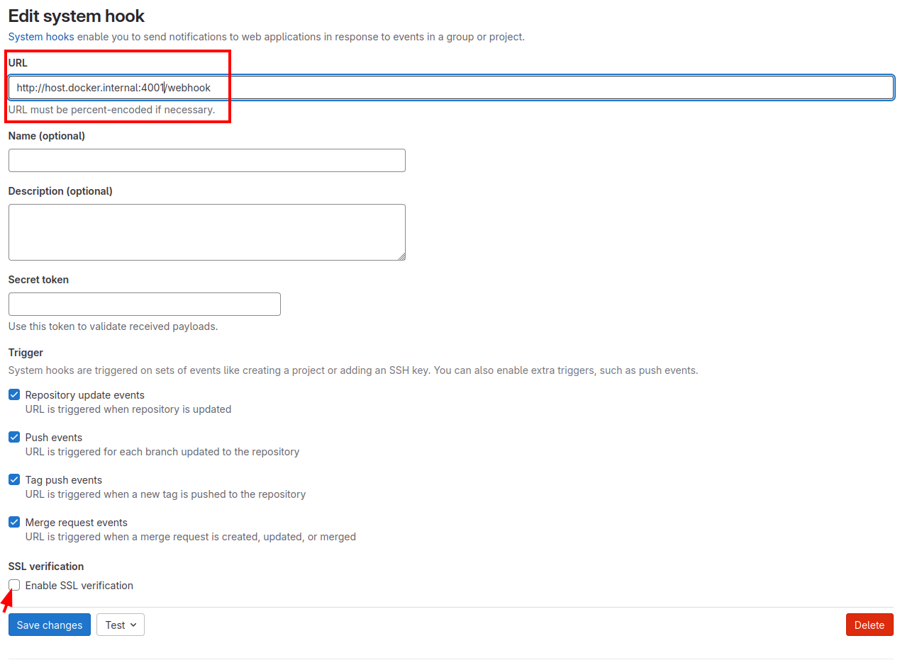
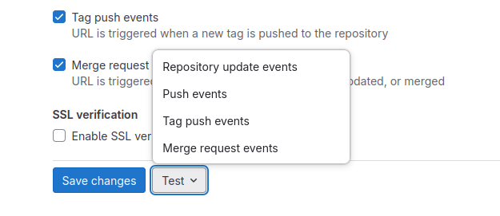
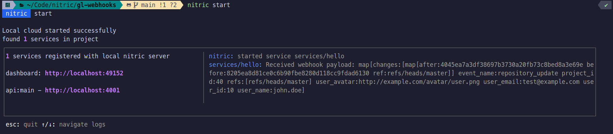

## Gitlab hooks with Nitric

This project demonstrates spinning up a local gitlab server to test against a nitric service that will accept webhooks from gitlab.

## Running the project

To run this project you'll need:

- Docker & Docker Compose
- Nitric CLI

Start by running the gitlab server:

```bash
docker compose up
```

Give it some time, it takes a while to start the first time due to db migrations etc.

Once you've confirmed that you can access the [login page](http://localhost:8080)

You can login with the following:

Username: root
Password: ThisIsNotDefault!

Once you've logged in start the nitric service:

```
nitric start
```

## Testing the webhooks

Go to the [system webhooks page](http://localhost:8080/admin/hooks) of your locally running gitlab instance: 

Add a system webhook that will call the nitric service:

> Because the gitlab service is running in a container you will need to refer to the docker host rather than localhost
> `host.docker.internal` on Windows and Macos or `172.17.0.1` in Linux.

Check the output of `nitric start` to ensure that you configure the correct port.
Also make sure you disable SSL verification for local testing.



Once you've configured the webhook you can run a test against the nitric service:



> Note that Merge request hook tests will not work unless you have a project that exists with merge requests

Once you've run a test you should see output like the following in your locally running nitric service:


You can also test against a nitric service running in the cloud by deploying your service and updating the webhook address to the address of the deployed API Gateway.
